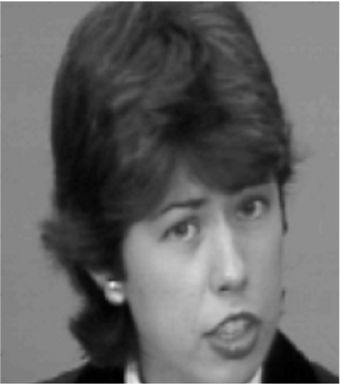
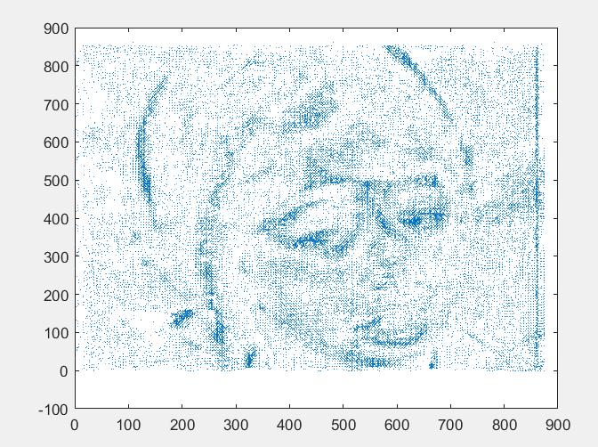
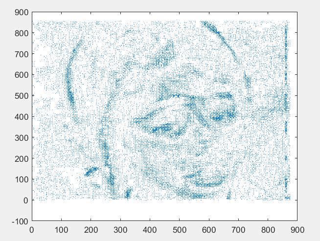

# Optical Flow Estimation Project

## Project Overview
This project focuses on the **estimation of optical flow**—a technique to compute the apparent motion of objects, surfaces, and edges between two consecutive frames of an image sequence caused by the relative motion between the observer and the scene.

Two primary methods are implemented and explored:
1. **Horn-Schunck Method** (a global method)
2. **Lucas-Kanade Method** (a local method)

The project also introduces a hybrid approach that combines the strengths of both.

---

## Mathematical Formulations

### Optical Flow Constraint Equation (OFCE)
The intensity of pixels remains constant during motion:
\[
I_x(p)u + I_y(p)v + I_t(p) = 0
\]
where:
- \(I_x, I_y, I_t\) are the spatial and temporal intensity gradients.
- \(u, v\) are the components of the velocity vector.

---

### Horn-Schunck Regularization
Minimizes the following energy function for smoothness:
\[
E(u, v) = \int_\Omega \left( (I_x u + I_y v + I_t)^2 + \alpha \left( \|\nabla u\|^2 + \|\nabla v\|^2 \right) \right) d\Omega
\]

### Lucas-Kanade Local Estimation
Solves for optical flow locally using:
\[
E_{LK} = \sum_{i} \left( I_{xi} u + I_{yi} v + I_{ti} \right)^2
\]

---

## Results

### Input Frames
Below are the two consecutive frames used as input for the optical flow estimation:

  

### Estimated Optical Flow
The estimated velocity vectors are shown below:

#### Using Horn-Schunck Method:

#### Using Lucas-Kanade Method:

