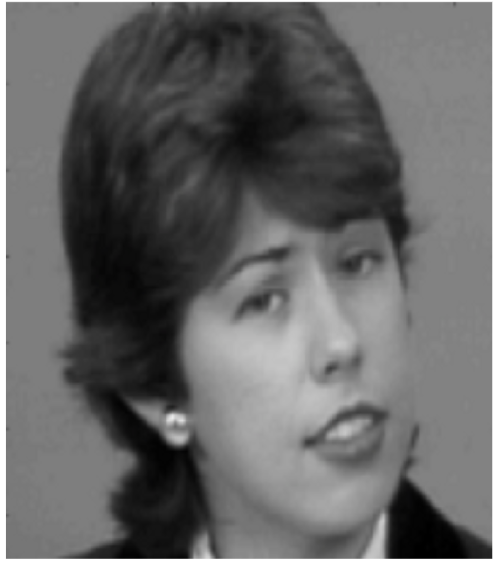

# Optical Flow Estimation Project

## Project Overview
This project estimates **optical flow**—the apparent motion of image intensity between two frames—using two classic methods:

1. **Horn–Schunck (HS)** — global, dense flow with smoothness regularization  
2. **Lucas–Kanade (LK)** — local, windowed least-squares fit

A simple **hybrid** scheme combines their strengths.

---

## Mathematical Formulations

### Brightness Constancy ⇒ Optical Flow Constraint (OFC)
Assume intensity is approximately constant along motion trajectories:
\[
I(x+u,\;y+v,\;t+\Delta t) \approx I(x,\;y,\;t).
\]
A first-order Taylor expansion yields the **optical flow constraint** at pixel \(p=(x,y,t)\):
\[
I_x(p)\,u(p) + I_y(p)\,v(p) + I_t(p) = 0,
\]
or in vector form
\[
\nabla I(p)^\top \mathbf{w}(p) + I_t(p) = 0,\qquad
\mathbf{w}(p)=\begin{bmatrix}u(p)\\ v(p)\end{bmatrix}.
\]

**Notation.** \(I_x,I_y,I_t\) are spatial/temporal derivatives; \(u,v\) are the horizontal/vertical flow components.

---

### Horn–Schunck (Global Regularization)
Minimize a dense flow with a quadratic smoothness prior:
\[
E(u,v)=\iint_{\Omega} \Big( (I_x u + I_y v + I_t)^2
+ \alpha\big(\|\nabla u\|^2+\|\nabla v\|^2\big) \Big)\,d\Omega,
\]
where \(\alpha>0\) trades off data fidelity vs. smoothness.

**Euler–Lagrange / Classic HS Iteration**
Let \(\bar u,\bar v\) be local spatial averages (e.g., 4- or 8-neighborhood). Iteratively update:
\[
u^{(k+1)} = \bar u^{(k)} - \frac{I_x\big(I_x \bar u^{(k)} + I_y \bar v^{(k)} + I_t\big)}{\alpha + I_x^2 + I_y^2},
\qquad
v^{(k+1)} = \bar v^{(k)} - \frac{I_y\big(I_x \bar u^{(k)} + I_y \bar v^{(k)} + I_t\big)}{\alpha + I_x^2 + I_y^2}.
\]
Run at multiple pyramid levels to handle large motions (warp the second frame toward the first after each update).

---

### Lucas–Kanade (Local Least Squares)
Estimate a single flow \(\mathbf{w}=[u\;v]^\top\) per window \(W\) by minimizing
\[
E_{LK}(\mathbf{w})=\sum_{i\in W}\omega_i\,\big(I_{x,i}u+I_{y,i}v+I_{t,i}\big)^2,
\]
with optional weights \(\omega_i\) (e.g., Gaussian centered in the window).

This yields the **normal equations**:
\[
\underbrace{\begin{bmatrix}
\sum \omega_i I_{x,i}^2 & \sum \omega_i I_{x,i}I_{y,i} \\
\sum \omega_i I_{x,i}I_{y,i} & \sum \omega_i I_{y,i}^2
\end{bmatrix}}_{G\ \text{(structure tensor)}}
\begin{bmatrix}u\\ v\end{bmatrix}
=
-\underbrace{\begin{bmatrix}
\sum \omega_i I_{x,i}I_{t,i} \\
\sum \omega_i I_{y,i}I_{t,i}
\end{bmatrix}}_{\mathbf{b}},
\qquad
\mathbf{w} = -G^{-1}\mathbf{b}\ \text{ if } G \text{ is well-conditioned.}
\]

**Aperture / Conditioning.** Reliable estimates require both eigenvalues of \(G\) to be sufficiently large (corner-like texture). Along edges, \(G\) is nearly rank-1 and motion is ambiguous.

---

### Hybrid Scheme (Example)
Use LK to get an initial flow and confidence, then refine with HS:

1. **Initialization:** \(\mathbf{w}_0\) from LK at each pixel (using Gaussian windows).  
2. **Confidence:** \(c(p)=\min(\lambda_{\min}(G(p))/\tau,\,1)\) with threshold \(\tau>0\).  
3. **Refinement:** Run HS starting from \(\mathbf{w}_0\) and use a **spatially varying** smoothness
\[
\alpha(p)=\alpha_{\max}\,(1-c(p))+\alpha_{\min}\,c(p),
\]
so textured regions (high \(c\)) are allowed to vary more, while flat regions are smoothed more.

---

## Results

### Input Frames
Two consecutive frames used as input:

 

### Estimated Optical Flow

**Horn–Schunck (dense, smooth):**  

**Lucas–Kanade (local, feature-sensitive):**  

---

## Practical Notes
- **Derivatives:** compute \(I_x,I_y\) via derivative-of-Gaussian; \(I_t\) via frame differencing (with warping at each pyramid level).  
- **Pyramids:** coarse→fine with image warping to capture large displacements.  
- **Tuning:** increase \(\alpha\) (HS) for smoother fields; increase window size or Gaussian σ (LK) for robustness but less detail.

---

## References
- Horn, B. K. P., & Schunck, B. G. (1981). *Determining optical flow*. Artificial Intelligence.  
- Lucas, B. D., & Kanade, T. (1981). *An iterative image registration technique with an application to stereo vision*. IJCAI.
